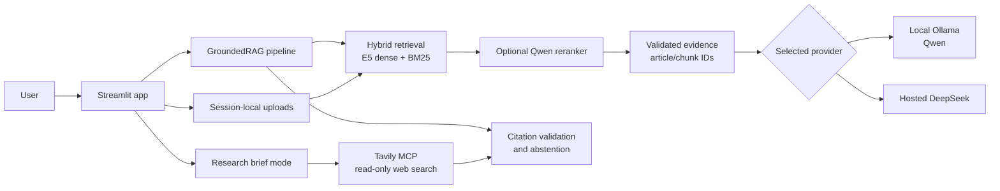

# Greek Newsroom Evidence Assistant

An evidence-grounded Greek-language news assistant built for newsroom
research. It combines dense and lexical retrieval, optional local reranking,
provider-neutral generation, structural citation validation, uploaded-source
search, streaming direct QA, and bounded Tavily web research.

> This is a separate engineering-focused companion to the earlier
> [Greek-Journalistic-RAG-Chatbot](https://github.com/narmenakis/Greek-Journalistic-RAG-Chatbot)
> repository associated with a journal publication. It is not the publication
> repository itself.

## What this project demonstrates

- Retrieval-Augmented Generation (RAG) over a focused Greek news corpus.
- Stable article and chunk provenance carried through retrieval and answers.
- Hybrid E5-large/BM25 retrieval with an opt-in Qwen3 reranker.
- Runtime switching between local Ollama and hosted DeepSeek from Streamlit.
- Fail-closed citation validation and language-matched abstention.
- Session-local uploads that remain separate from the archive.
- A bounded, read-only Tavily MCP research workflow for current web evidence.
- Deterministic tests and offline evaluation artifacts rather than unsupported
  claims about model quality.

## Architecture



The direct-QA path does not require tools or an agent. Research mode is an
explicit opt-in path with a bounded Tavily tool loop; web results are labeled
separately from archive and uploaded-source evidence.

## Current scope

The development corpus contains 200 source URLs from four Greek outlets and a
validated local snapshot of 199 articles. It is intentionally Tempi-focused,
with a small non-Tempi control set. The scraped article text and Chroma vector
database are generated locally and are not distributed here.

## Setup

Python 3.11 is required. A local virtual environment is recommended:

```bash
python3.11 -m venv .venv
source .venv/bin/activate
./.venv/bin/pip install -r requirements.lock
cp .env.example .env
```

The example profile targets an Apple Silicon demonstration: local Ollama,
MPS embeddings, and the opt-in Qwen reranker. On another machine, change
`RAG_EMBEDDING_DEVICE` and `RAG_RERANKER_DEVICE` to `cpu` or `auto` as
appropriate. No API key is stored in the repository.

### Build the local corpus and index

The URL list is public input; article text is fetched at setup time and remains
local. Check each publisher's terms and robots policy before scraping:

```bash
PYTHONPATH=src ./.venv/bin/python scraper.py --resume
PYTHONPATH=src ./.venv/bin/python -m journalism_rag.indexer \
  --embedding-batch-size 8 --chroma-batch-size 32
```

The indexer uses token-based chunks, E5's prompt contract, stable content-hash
IDs, and a persisted Chroma compatibility contract. It can be resumed safely;
use `--reset` only when intentionally rebuilding the selected collection.

### Run Streamlit

```bash
set -a
source .env
set +a
PYTHONPATH=src ./.venv/bin/streamlit run app.py
```

The sidebar selector switches between `Τοπικό Ollama` and `Hosted DeepSeek`
without editing `.env` or restarting Streamlit. Direct QA streams through both
providers. Ollama must already be running locally and the configured model must
already exist; the application never downloads an LLM automatically.

To use the project Ollama profile, create it explicitly after installing the
base model:

```bash
ollama pull qwen3.5:9b-q4_K_M
ollama create journalism-rag-qwen3.5:9b -f ollama/Modelfile.qwen3.5-9b
```

Hosted DeepSeek requires `DEEPSEEK_API_KEY`. Live research additionally
requires `TAVILY_API_KEY`; it is available from either selected provider, but
formal live-provider measurements are deliberately deferred in this release.

## Evidence and safety boundaries

The pipeline preserves source identifiers from retrieval through generation.
Answers with nonexistent citations, no usable citation, or insufficient
evidence fail closed to a Greek abstention response. Uploaded documents are
bounded and session-local. Fetched web pages are treated as untrusted evidence,
not as instructions or additional tools.

The local Ollama path keeps corpus and question data on the machine. In
DeepSeek mode, retrieved evidence is sent to the hosted API, and follow-up
question rewriting may send recent conversation text; the UI discloses this
boundary. API keys are read only from the ignored `.env` file and are never
written to logs or evaluation artifacts.

The sign-in screen is a demonstration identity mechanism for associating a
conversation with a user in the UI. It is not authentication or multi-user
authorization.

## Evaluation evidence

The checked-in reports describe the 11-case, human-reviewed fixture and the
current 199-article snapshot. They are measurements of this corpus and local
hardware, not general claims about Greek-language model quality.

| Component | Result recorded in the repository |
| --- | --- |
| E5-large embedding | Recall@5 0.4833, nDCG@10 0.5456, 2.3 GB peak memory |
| E5-base embedding | Recall@5 0.4000, nDCG@10 0.3938 |
| Qwen3 reranker on MPS | Recall@5 0.5833, MRR 0.7617, 16.9 s reranking time |
| Generation contracts | 9 deterministic cases using mocked providers |
| Automated tests | 165 tests passing in the validated private checkpoint |

The test suite does not call Ollama, DeepSeek, or Tavily. The reports clearly
separate deterministic behavior, mocked provider contracts, and live hardware
measurements. The 73K-article corpus remains deferred until evaluation and
resource behavior are stable at the current scale.

## Interview demonstration

1. Show the architecture and explain why retrieval and generation are separate.
2. Run a Greek direct question with local Ollama and inspect its source IDs.
3. Switch to DeepSeek from the sidebar and point out the explicit hosted-data
   disclosure.
4. Upload a small Markdown or text-based PDF source and query it separately.
5. Enable research mode with Tavily and show distinct web citations and times.
6. Finish with the evaluation reports and the fail-closed citation contract.

## Project layout

- `app.py` — Streamlit presentation layer and runtime provider switch.
- `src/journalism_rag/` — loader, chunker, embeddings, retrieval, reranking,
  providers, citations, uploads, streaming, MCP, and evaluation code.
- `scraper.py` — bounded URL-to-local-CSV ingestion.
- `ollama/Modelfile.qwen3.5-9b` — reproducible local model profile.
- `evaluation/` — reviewed questions, manifests, benchmark reports, and mocked
  generation-contract evidence.
- `tests/` — deterministic unit and provider-contract tests.

## License and data

The project code is released under the MIT License. See `LICENSE` and
`DATA_NOTICE.md`. The repository distributes source URLs and metadata only;
publishers retain rights to their article content. Users are responsible for
following applicable laws and publisher terms when fetching data locally.
